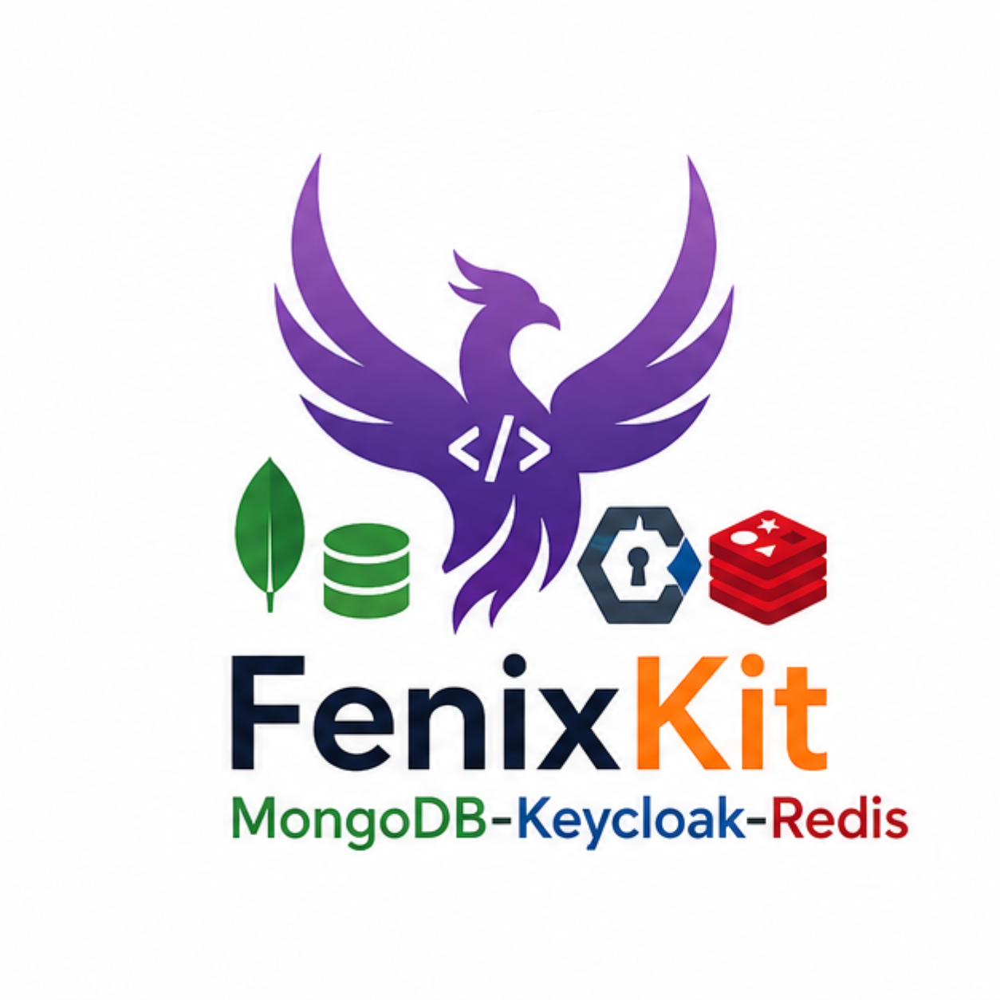

# FenixKit — .NET Minimal API  MongoDB + Keycloak + Redis

<p align="center">
  <a href="https://fenixkit.dev">
    
  </a>
</p>
<h3 align="center">
  Get it here: <a href="https://fenixkit.dev">fenixkit.dev</a>
</h3>

> **Ship faster. Build smarter.**  
> A production-ready .NET Minimal API starter with Keycloak JWT authentication, Redis cache-aside, MongoDB, and zero manual setup.

Keycloak JWT auth is the hardest part to get right in a new .NET API. Wrong token validation, missing role checks, broken Swagger login flows, no health check on the auth server — all fixable, all time-consuming. FenixKit ships with all of it wired up from day one, plus a full tag-based Redis cache layer that degrades gracefully when Redis is unavailable.

> **Keycloak and Redis run out of the box.** A pre-built realm with two test users is imported automatically when the Docker stack starts. No Keycloak or Redis setup required.

---

## What's Inside

| Feature | Details |
|---|---|
| **Keycloak Auth** | JWT Bearer validation  |
| **Role-based policies** | `Authenticated` and `AdminOnly` policies wired in from the start |
| **Swagger OAuth2 PKCE** | Authorize button in Swagger UI logs in via Keycloak — tokens injected automatically |
| **Pre-built realm** | `realm-export.json` imported at startup — two test users, one client, two roles |
| **Redis cache-aside** | 3-level tag-based invalidation; FailOpen / FailClosed; optional via `Cache:Enabled` |
| **Keycloak health check** | `/health/ready` includes Keycloak reachability via OIDC discovery |
| **Redis health check** | `/health/ready` includes Redis ping — omitted automatically when cache is disabled |
| **Auth example endpoints** | `/api/auth-examples/me` and `/api/auth-examples/admin` — working patterns to copy |
| **Minimal API** | .NET 8 / .NET 10 — route grouping, no controllers, fast startup |
| **MongoDB** | `MongoRepository` via `IDBRepository`, singleton, health-checked |
| **ErrorOr** | Result pattern throughout — no exceptions for control flow |
| **Offset + Cursor pagination** | Both strategies included, pick the right one per endpoint |
| **BaseRepository** | 7 domain hooks + 4 cache key hooks — extend CRUD without rewriting it |
| **Global error handler** | RFC 7807 `ProblemDetails` on every unhandled exception |
| **Docker + Compose** | API + MongoDB + Keycloak + Redis, healthcheck-gated startup order |
| **Environment variables** | `.env.example` with placeholder resolution via Steeltoe |

---

## Why Not Wire Auth Yourself?

| Starting from scratch | Using FenixKit |
|---|---|
| Hours configuring JWT Bearer options | Pre-configured, tested, ready |
| Manual Keycloak realm + client setup | `realm-export.json` imported on first `docker compose up` |
| Swagger Authorize button doesn't work | OAuth2 PKCE flow wired in — click Authorize, log in, done |
| Role checks scattered across handlers | Centralised policies: `RequireAuthorization("AdminOnly")` |
| No health check on the auth server | Keycloak OIDC discovery check in `/health/ready` |
| Token validation breaks on key rotation | Keycloak public keys fetched automatically via metadata URL |
| Reading claims is inconsistent | Typed `UserInfoResponse` with username, email, roles, subject |
| Cache invalidation built from scratch | Tag-based invalidation in `BaseRepository` — automatic on every write |
| Redis outage kills the API | FailOpen mode: Redis errors treated as cache misses, falls through to MongoDB |

---

## Authentication Architecture

Keycloak issues JWT tokens. The API validates every token against the Keycloak  — fetched automatically from the OIDC discovery document.

```
Client → POST /realms/fenixkit/protocol/openid-connect/token → JWT
Client → GET  /api/products/ + Bearer <JWT> → API validates → 200 OK
                                                             → 401 if missing/invalid
                                                             → 403 if wrong role
```


## Protecting Endpoints

```csharp
// Any authenticated user
group.MapGet("/orders", GetOrders)
    .RequireAuthorization("Authenticated");

// Admin role only
group.MapDelete("/orders/{id}", DeleteOrder)
    .RequireAuthorization("AdminOnly");
```

Both policies are defined in `Auth/Keycloak/Extensions/AuthExtensions.cs`. Adding a new policy is one block:

```csharp
.AddPolicy("PremiumOnly", policy =>
    policy.RequireAuthenticatedUser()
          .RequireRole("premium"))
```

Then assign the `premium` realm role to users in the Keycloak admin console.

---

## Reading the Current User

```csharp
private static IResult Me(HttpContext ctx)
{
    var username = ctx.User.Identity?.Name;           // preferred_username claim
    var email    = ctx.User.FindFirst("email")?.Value;
    var subject  = ctx.User.FindFirst("sub")?.Value;
    var isAdmin  = ctx.User.IsInRole("admin");
    var roles    = ctx.User.FindAll("roles").Select(c => c.Value);

    return Results.Ok(new UserInfoResponse(username, email, subject, roles));
}
```

`/api/auth-examples/me` is a working example of this pattern included in the kit.

---

## Pre-configured Keycloak Realm

`keycloak/realm-export.json` is imported automatically on first startup. No manual steps.

| Item | Value |
|---|---|
| Realm | `fenixkit` |
| Client | `fenixkit-api` (Authorization Code + PKCE) |
| Redirect URIs | `http://localhost:8081/*` (Swagger UI) |
| Realm roles | `admin`, `user` |
| Test user | `admin-test` / `admin123` — roles: `admin`, `user` |
| Test user | `user-test` / `user123` — roles: `user` |

To customise the realm, edit `keycloak/realm-export.json` or use the Keycloak admin console at `http://localhost:8082`.

---

## Redis Cache Layer

The cache follows the **cache-aside pattern**: the repository checks Redis before querying MongoDB, and populates Redis after a miss. Invalidation is tag-based — every cached entry is registered under one or more tags, and writing an entity wipes all entries under its tags.

### Three Levels of Control

| Level | Mechanism | Who uses it |
|---|---|---|
| **3 — Automatic** | `BaseRepository` calls `GetInvalidationTags` and wipes tags after every write | No code needed — always on |
| **2 — Tag-based** | `_Cache.InvalidateByTagAsync("product:category:Electronics")` | Derived repository — for custom domain queries |
| **1 — Manual** | `_Cache.InvalidateAsync("product:abc123")` | Derived repository — surgical single-key removal |

### Storage Layout in Redis

```
myapi:product:abc123              STRING   JSON of ProductDetailResponse   TTL 5 min
myapi:product:paged:p1:s20        STRING   JSON of PagedResult<...>         TTL 5 min
myapi:product:cursor:start:20:fwd STRING   JSON of CursorPagedResult<...>   TTL 5 min
myapi:product:category:Gaming     STRING   JSON of List<ProductSummary>     TTL 5 min

myapi:tag:product                 SET      { all paged + cursor keys }        no TTL
myapi:tag:product:abc123          SET      { "myapi:product:abc123" }         no TTL
myapi:tag:product:category:Gaming SET      { "myapi:product:category:..." }   no TTL
```

Tag sets have no TTL by design — they are deleted when `InvalidateByTagAsync` runs, leaving no orphaned entries.

### ErrorBehavior Options

| Mode | Redis unavailable | Recommended when |
|---|---|---|
| `FailOpen` (default) | Cache treated as miss — falls through to MongoDB, request succeeds | Redis is a performance layer |
| `FailClosed` | Returns `Error.Unexpected` — request fails with 500 | Cache correctness is required |

### Cache Is Optional

Set `Cache:Enabled = false` to run without Redis. A `NullCacheService` no-op is registered in place of `RedisCacheService`. `IConnectionMultiplexer` is never registered and the Redis health check is omitted automatically. No code changes required.

### Overriding Cache Keys and Tags

Every cache key and invalidation tag is controlled by virtual hooks on `BaseRepository`:

```csharp
// ProductRepository.cs

protected override string GetCacheKey(string id)
    => $"product:{id}";

protected override IEnumerable<string> GetInvalidationTags(Product entity)
{
    yield return "product";                              // clears all paged + cursor pages
    yield return GetCacheKey(entity.Id);                // clears this product's by-ID entry
    yield return $"product:category:{entity.Category}"; // clears the category-filtered list
}
```

On an update that changes `Category`, `BaseRepository` automatically unions the tags from both the original and updated entity — so both old and new category caches are invalidated.

---

## Health Checks

```
GET /health/live   → Liveness  — is the process alive?
GET /health/ready  → Readiness — is MongoDB reachable? Is Keycloak reachable? Is Redis reachable?
```

The Keycloak check fetches the OIDC discovery document (`/.well-known/openid-configuration`). The Redis check runs `PING`. Both degrade independently — a Redis failure does not affect Keycloak validation or MongoDB writes.

```json
{
  "status": "Healthy",
  "entries": {
    "mongodb":  { "status": "Healthy" },
    "keycloak": { "status": "Healthy" },
    "redis":    { "status": "Healthy" }
  }
}
```

Redis is omitted from `/health/ready` when `Cache:Enabled = false`.

---

## Quick Start

```bash
# 1. Copy the environment file
cp .env.example .env

# 2. Start the full stack — API + MongoDB + Keycloak + Redis
docker compose up --build

# API           → http://localhost:8081
# Swagger       → http://localhost:8081/swagger
# Keycloak admin → http://localhost:8082  (admin / changeme)
```

Open Swagger, click **Authorize**, log in as `admin-test` / `admin123`. All requests will carry the Bearer token automatically. Redis starts alongside the other services — no extra steps.

---

## Error Responses

All errors — including auth errors — follow [RFC 7807](https://www.rfc-editor.org/rfc/rfc7807) `application/problem+json`:

| Status | Title | Cause |
|---|---|---|
| `401` | `Auth.Unauthorized` | Missing, expired, or invalid JWT |
| `403` | `Auth.Forbidden` | Valid JWT but insufficient role |
| `404` | `Resource.NotFound` | Entity not found |
| `409` | `Resource.Conflict` | Duplicate detected |
| `422` | `Validation Error` | Input validation failed |
| `500` | `Server Error` | Unhandled exception — ProblemDetails, never HTML |

---

## Technologies

| Package | Role |
|---|---|
| .NET 8 LTS (C# 12) · .NET 10 (C# 14) | Runtime and language |
| Keycloak 24 | OIDC / OAuth2 identity provider |
| Microsoft.AspNetCore.Authentication.JwtBearer | JWT Bearer validation |
| MongoDB.Driver | Official MongoDB .NET driver |
| Redis 8 / Valkey 7.2+ | Cache server — compatible with both (`docker-compose.valkey.yml` included) |
| StackExchange.Redis | Redis client — tag-based cache-aside layer |
| ErrorOr v2 | Result pattern — no exceptions for domain errors |
| Swashbuckle.AspNetCore | Swagger UI + OAuth2 PKCE flow |
| DotNetEnv + Steeltoe | `.env` file + `${VAR}` placeholder resolution in appsettings |
| Docker + Docker Compose | Full stack in one command |

---

## Upgrading from FenixKit Base

Already own the base kit? See `MIGRATION.md` — step-by-step instructions for adding Keycloak auth to an existing FenixKit project or any .NET 8 Minimal API.

---

## License

FenixKit MongoDB + Keycloak + Redis is a commercial product. Each purchase grants a lifetime licence for unlimited personal and commercial projects.

👉 **[fenixkit.dev](https://fenixkit.dev)**
